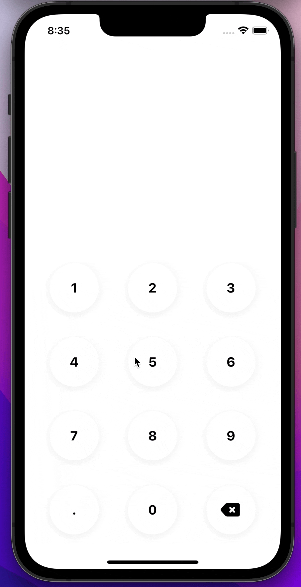

[](https://github.com/WrathChaos/react-native-modern-keyboard)

[](https://www.npmjs.com/package/react-native-modern-keyboard)
[](https://www.npmjs.com/package/react-native-modern-keyboard)

[](https://opensource.org/licenses/MIT)
[](https://github.com/prettier/prettier)

<p align="center">
  
</p>

# Installation

Add the dependency:

```bash
npm i react-native-modern-keyboard
```

## Peer Dependencies

<h5><i>Zero Dependency 🎉</i></h5>


# Usage

## Import

```jsx
import ModernKeyboard from "react-native-modern-keyboard";
```

## Fundamental Usage

If you need to use the value as a number you can parse it with `Number(value)`

```jsx
const [input, setInput] = useState<string>();

<Text style={styles.textStyle}>{input}</Text>
<ModernKeyboard
    onInputChange={(value: string) => {
        setInput(value);
    }}
/>
```

## Example Project 😍

You can checkout the example project 🥰

Simply run

- `npm i`
- `react-native run-ios/android`

should work of the example project.

# Configuration - Props


textColor?: string;
textActiveColor?: string;

## Fundamentals

| Property    |  Type  |  Default  | Description                                            |
| ----------- | :----: | :-------: |--------------------------------------------------------|
| onInputChange       | function  | undefined | set your own logic for the input change functionality  |

## Customization (Optionals)

| Property                   |    Type    |    Default    | Description                                                 |
|----------------------------|:----------:|:-------------:|-------------------------------------------------------------|
| style                      | ViewStyle  |    default    | set or override the style object for the main container     |
| size                       |   number   |      75       | change the keypads' size                                    |
| textStyle                  | TextStyle  |    default    | set or override the style object for the keypads text style |
| backspaceStyle             | ImageStyle |    default    | set or override the style object for the backspace style    |
| backspaceImageSource       |   asset    |    default    | set your own backspace image                                |
| outerBackgroundColor       |     string      | "transparent" | change the outer background color                           |
| outerActiveBackgroundColor |     string      |       "rgba(0, 173, 255, 0.1)"        | change the outer active background color                    |
| buttonColor                |     string      |     "#fff"          | change the button keypad color                              |
| buttonActiveColor          |     string      |       "#00ADFF"        | change the active button keypad  color                      |
| textColor                  |     string      |      "#000"         | change the keypad's text color                              |
| textActiveColor                 |     string      |       "#fff"         | change the keypad's active text color                            |

## Future Plans

- [x] ~~LICENSE~~
- [ ] Write an article about the lib on Medium


## Author

FreakyCoder, kurayogun@gmail.com

## License

React Native Modern Keyboard is available under the MIT license. See the LICENSE file for more info.
